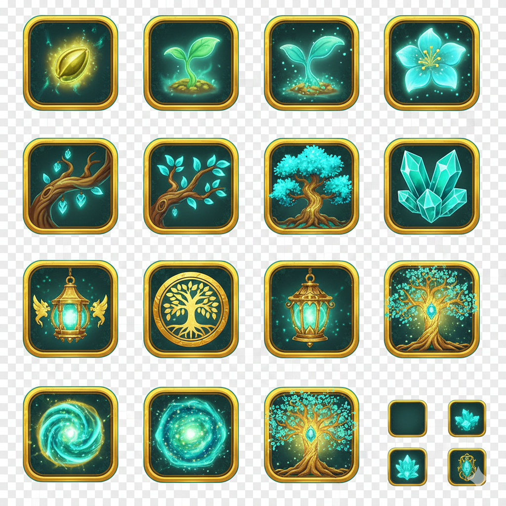
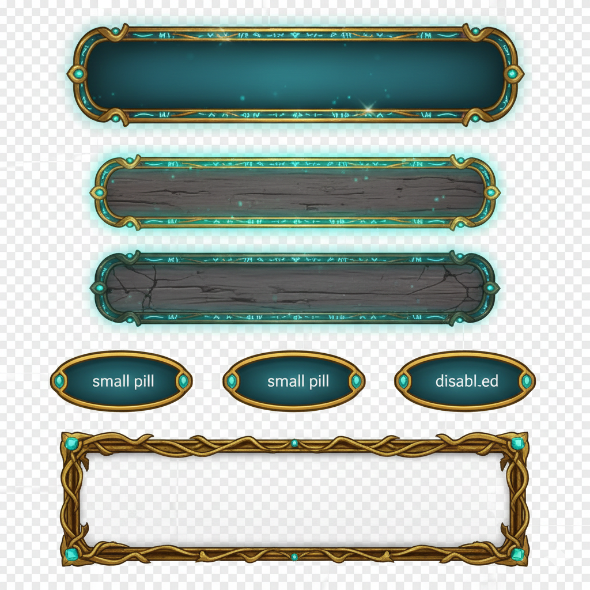
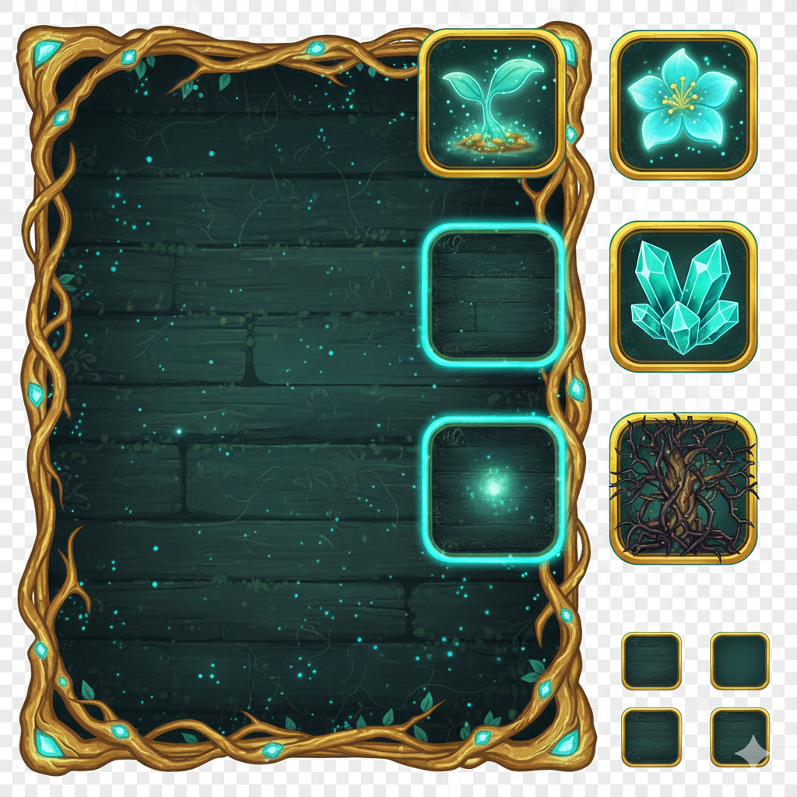
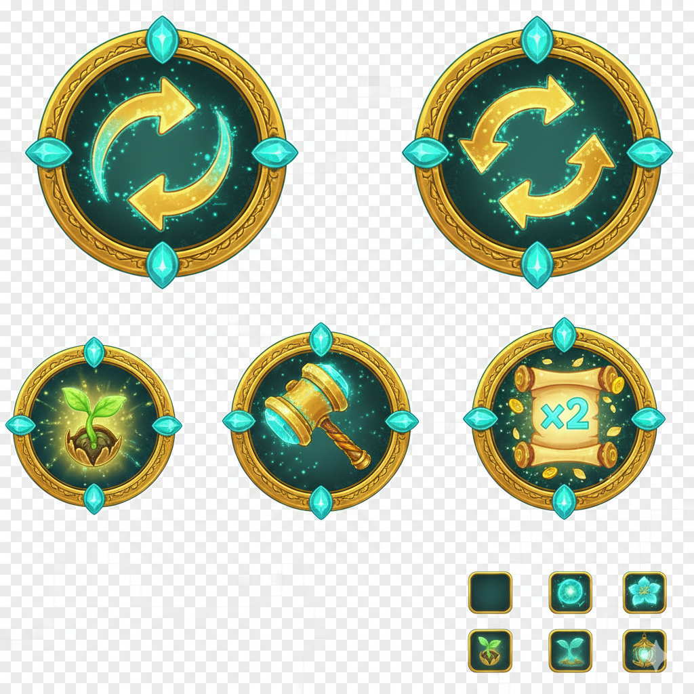
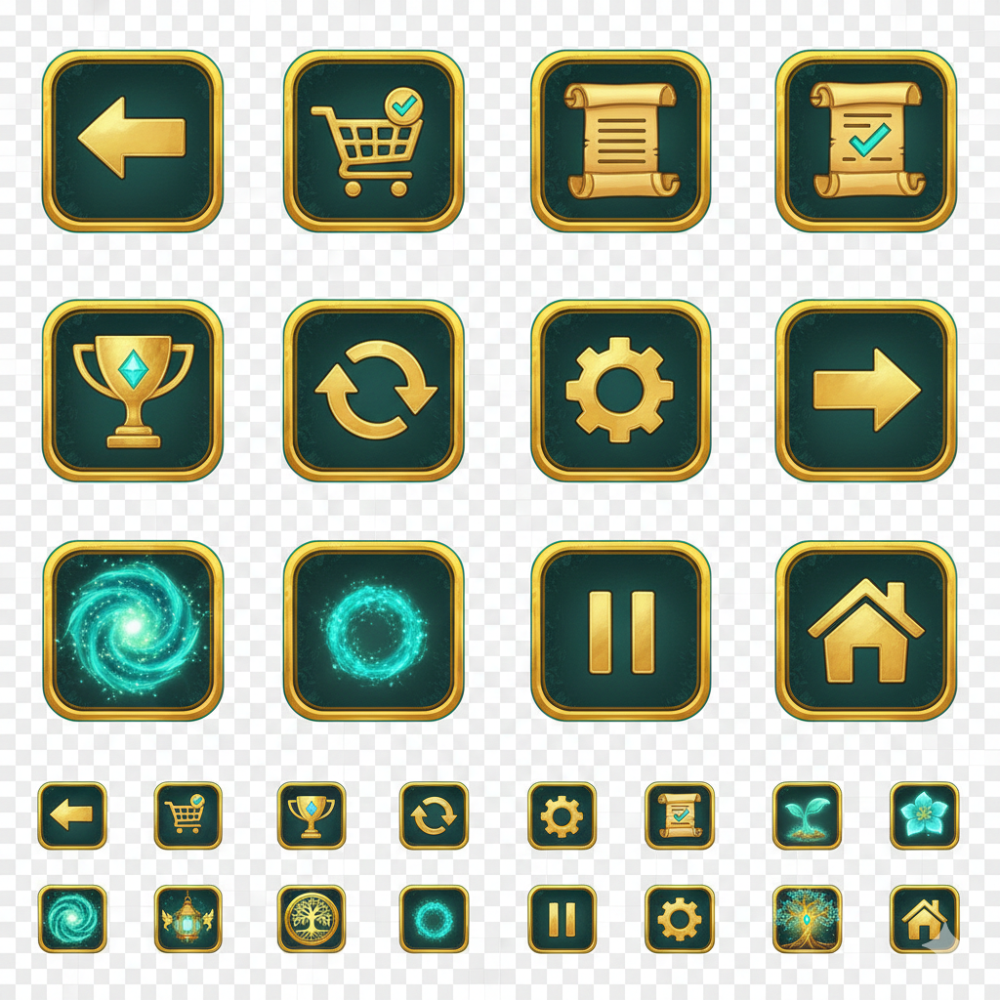
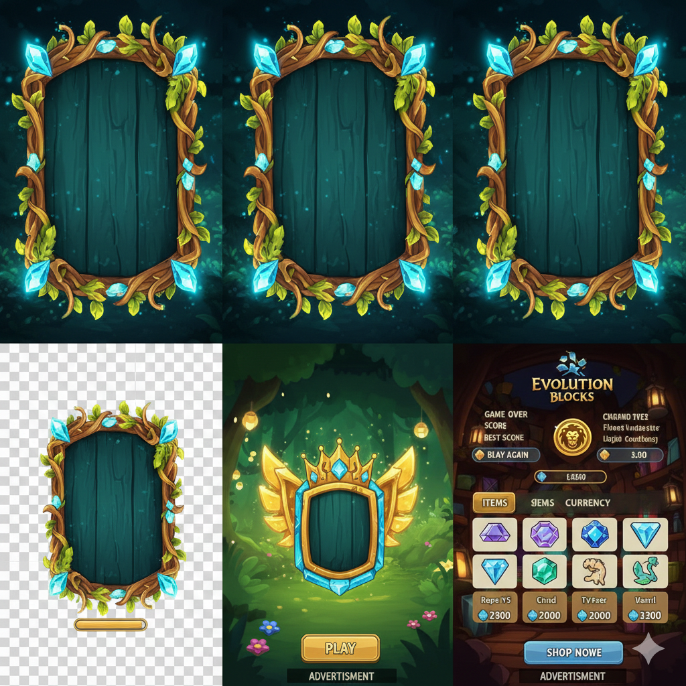
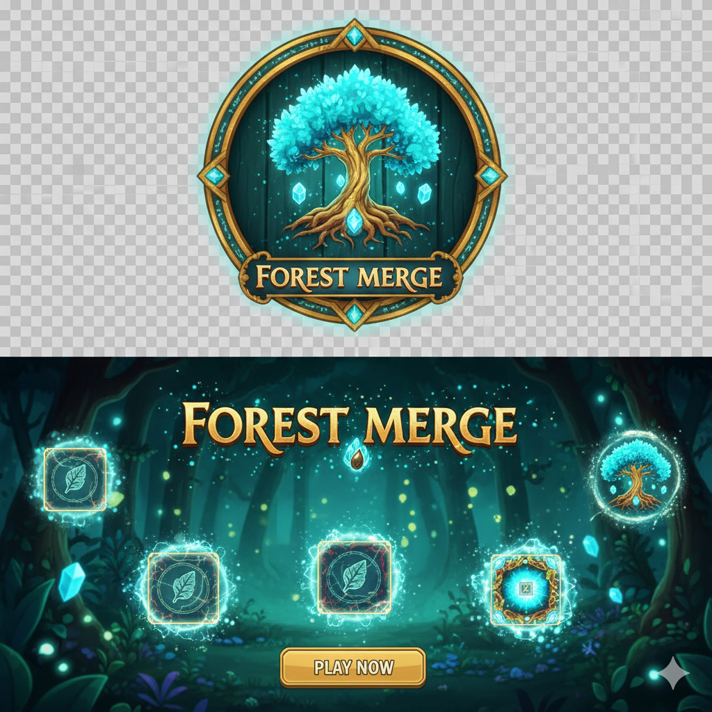
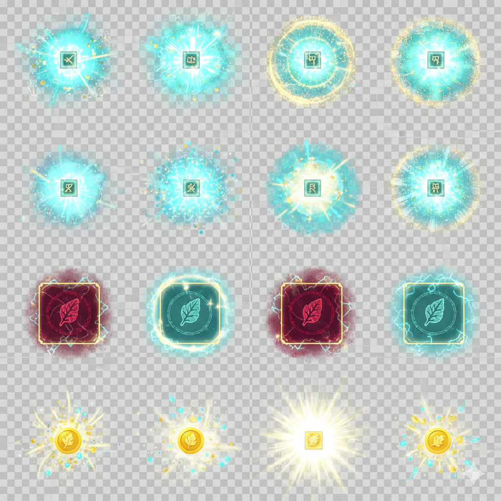
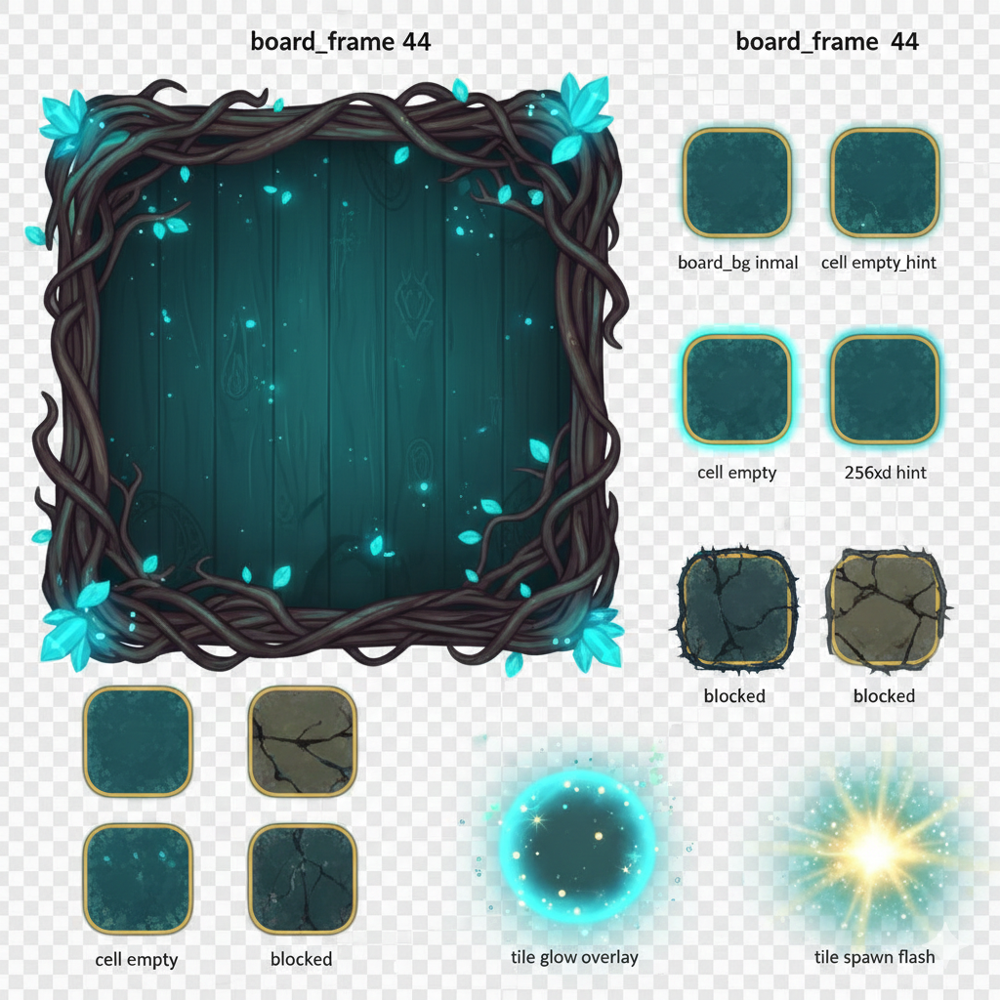

# Visual Reference Gallery

이 문서는 `assets/images/reference/packs`의 원본 패키지를 눈으로 확인하며 작업하기 위한 갤러리입니다.

## 1) Tiles / Evolution Icons
- File: `assets/images/reference/packs/pack_tiles_evolution_icons.png`
- Suggested use: 타일 스타일 기준, 진화 단계 룩앤필

## 2) Button Skins / Frame
- File: `assets/images/reference/packs/pack_button_skins_and_frame.png`
- Suggested use: 버튼 스킨, 배너 프레임, 작은 pill 버튼

## 3) Board / Cells / Tile Samples
- File: `assets/images/reference/packs/pack_board_frame_cells_and_tile_samples.png`
- Suggested use: 보드 프레임, 셀 상태, 타일 배치 기준

## 4) Powerup Round Icons
- File: `assets/images/reference/packs/pack_powerup_round_icons.png`
- Suggested use: 아이템 버튼 아이콘 스타일 가이드

## 5) UI Icon Set
- File: `assets/images/reference/packs/pack_ui_icon_set.png`
- Suggested use: 설정/랭킹/미션/홈/뒤로가기 등 UI 아이콘 스타일

## 6) Panels / Cards / Shop Mock
- File: `assets/images/reference/packs/pack_panels_cards_and_shop_mock.png`
- Suggested use: 패널/카드 프레임 및 결과/상점 화면 톤

## 7) Logo / Title Scene
- File: `assets/images/reference/packs/pack_logo_and_title_scene.png`
- Suggested use: 브랜딩, 로고/메인 타이틀 연출

## 8) VFX Bursts / Tile States / Coin Flash
- File: `assets/images/reference/packs/pack_vfx_bursts_tile_states_coin_flash.png`
- Suggested use: 합성 이펙트, 경고 셀, 코인 플래시 스타일

## 9) Board Parts (Dark Vine Theme)
- File: `assets/images/reference/packs/pack_board_parts_dark_vine_theme.png`
- Suggested use: 대체 보드 프레임 테마, cell/blocked/spawn 파츠 참고

## Notes
- 현재 파일들은 레퍼런스 패키지입니다. 실제 런타임에는 개별 분리 리소스(PNG 투명)를 사용하는 것을 권장합니다.
- 기존 사용 경로: `assets/images/gameplay`, `assets/images/ui`, `assets/images/vfx`

